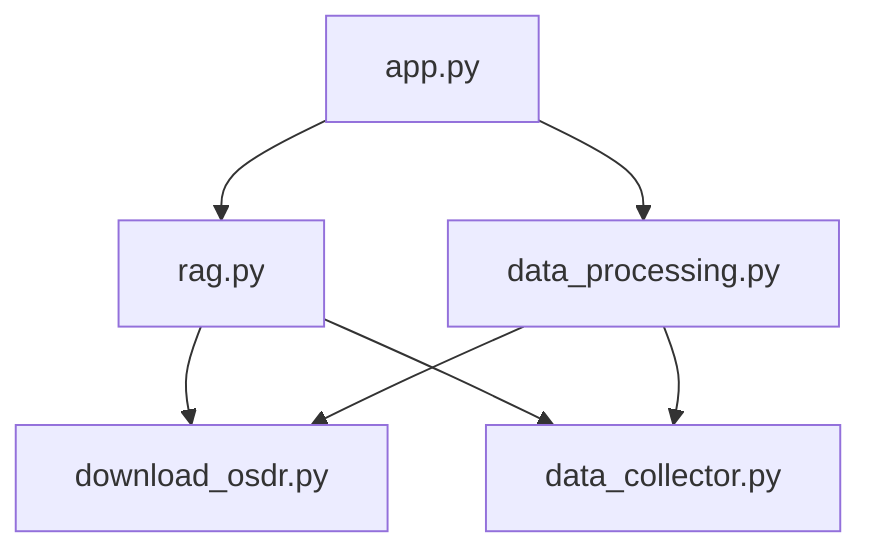
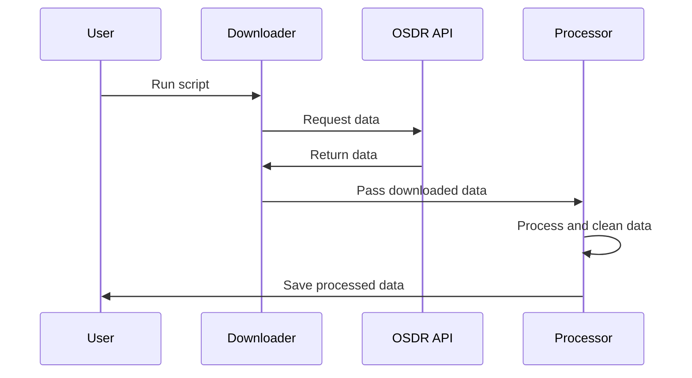
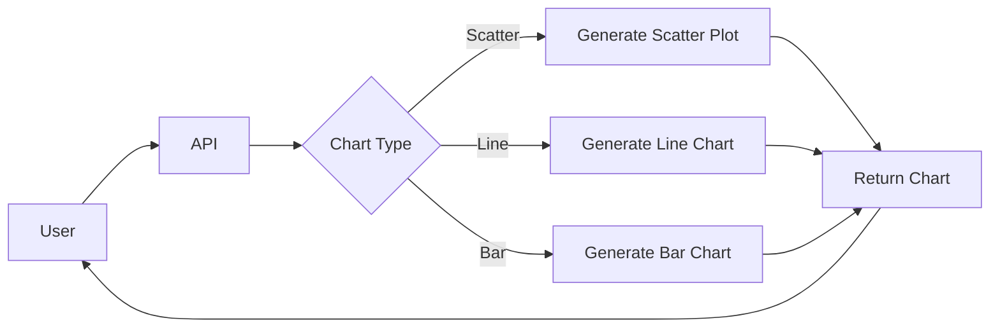
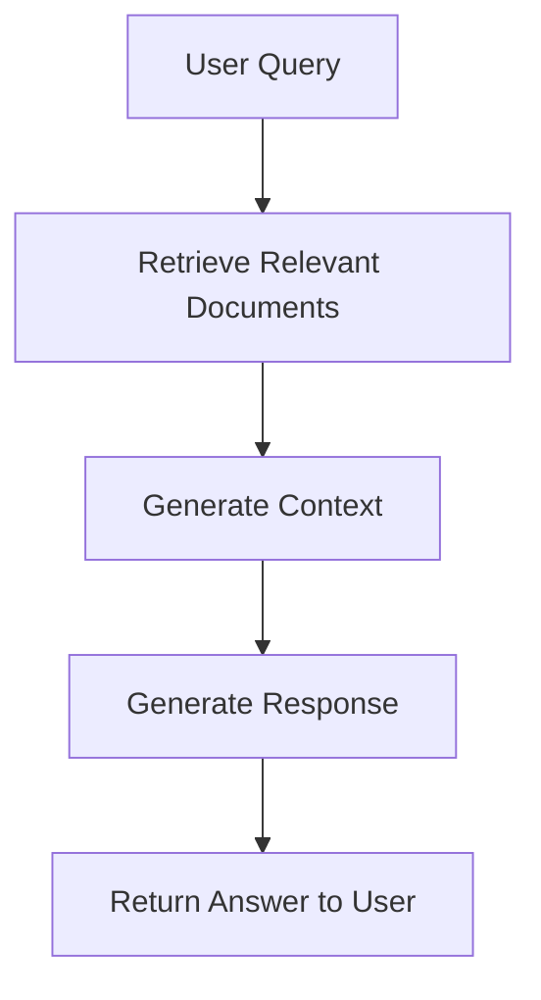

# NASA OSDR Data Analysis Project

This project provides tools for downloading, processing, and analyzing data from NASA's Open Source Development Resource (OSDR) platform. It includes a RESTful API for querying the data and generating visualizations.


## Table of Contents

- [Project Structure](#project-structure)
- [Installation](#installation)
- [Usage](#usage)
- [API Endpoints](#api-endpoints)
- [Data Processing](#data-processing)
- [Visualization](#visualization)
- [RAG Pipeline](#rag-pipeline)
- [Contributing](#contributing)
- [License](#license)

## Project Structure



- `app.py`: Main FastAPI application
- `rag.py`: Retrieval-Augmented Generation (RAG) pipeline
- `data_processing.py`: Data processing and file downloading
- `download_osdr.py`: OSDR data downloader
- `data_collector.py`: Alternative OSDR data collector

## Installation

1. Clone the repository:
   ```
   git clone https://github.com/your-username/nasa-osdr-project.git
   cd nasa-osdr-project
   ```

2. Create a virtual environment:
   ```
   python -m venv venv
   source venv/bin/activate  # On Windows, use `venv\Scripts\activate`
   ```

3. Install dependencies:
   ```
   pip install -r requirements.txt
   ```

4. Set up environment variables:
   Create a `.env` file in the project root and add your Google AI API key:
   ```
   GOOGLE_API_KEY=your_api_key_here
   ```

## Usage

1. Start the FastAPI server:
   ```
   uvicorn app:app --reload
   ```

2. Access the API at `http://localhost:8000`

3. Use the provided scripts to download and process OSDR data:
   ```
   python download_osdr.py
   python data_processing.py
   ```

## API Endpoints

- `POST /query`: Submit a query to the RAG pipeline
- `GET /suggest_charts`: Get chart suggestions based on the dataset
- `POST /generate_chart`: Generate a chart based on specified parameters

## Data Processing

The project includes two main scripts for data collection:

1. `download_osdr.py`: Downloads data from the OSDR API based on study IDs
2. `data_collector.py`: An alternative downloader that fetches individual files

The `data_processing.py` script processes the downloaded data and prepares it for analysis.



## Visualization

The project uses Matplotlib to generate visualizations. The API provides endpoints for suggesting and generating charts based on the processed data.



## RAG Pipeline

The Retrieval-Augmented Generation (RAG) pipeline combines information retrieval and text generation to provide accurate responses to user queries.



## Contributing

Contributions are welcome! Please feel free to submit a Pull Request.

## License

This project is licensed under the MIT License - see the [LICENSE](LICENSE) file for details.